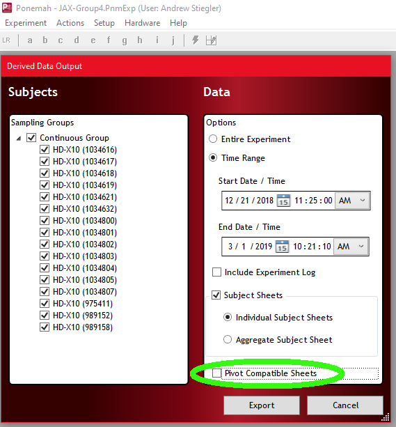

```{r setup, include=FALSE}
knitr::opts_chunk$set(echo = TRUE)
```

## Description
This is a package for interacting with telemetry data using R. Specific 
functions for importing data from DSI telemetry systems are included, as well 
as functions for analyzing telemetry data over various timescales.

## Installation
telemetRy is available on github. To install telemetRy, you'll need:    
[R > 3](https://www.r-project.org "R > 3.4")  
[devtools](https://github.com/r-lib/devtoolsdevtools "devtools") package from 
Hadley Wickham    
  
First, install devtools:
```{r eval=FALSE}
install.packages('devtools')
```
Then install telemetRy:
```{r eval=FALSE}
devtools::install_github(repo = 'andrewstiegler/telemetRy')
library(telemetRy)
```

## Importing DSI data
First data must be exported from DSI's Ponemah software. 

With an experiment open, navigate to Experiment > Export Data. In this pop-up, 
select subjects to export, a timerange to export, and make sure to un-check 
"Pivot Compatible Sheets"




Select "Export" and an Excel file will be generated. To import that Excel file 
into R, utilize the DSI_export_to_dataframe function:
```{r eval=FALSE}
exported_data <- DSI_export_to_dataframe('path_to_DSI_export')
```

The export will be a dataframe:

## Calculating typical day from DSI export
After importing into R, pass the imported dataframe to the typical_day function, 
and specify the beginning of the light cycle (in 24H). 
```{r eval=FALSE}
# For example, room lights turn on at 6AM
typical_day_output <- typical_day(data = exported_data, lights_on = 6)
```

## Other useful functions
Several functions are available for isolating BP parameters from datasets. 
Separate functions exist for the entire dataset or for typical_day averages. 
```{r eval=FALSE}
# For example, to isolate SBP from entire dataset
export_data_sbp <- isolate_sbp(data = exported_data)

# To isolate SBP from a typical_day
typical_day_sbp <- typical_sbp(data = typical_day_output)
```

