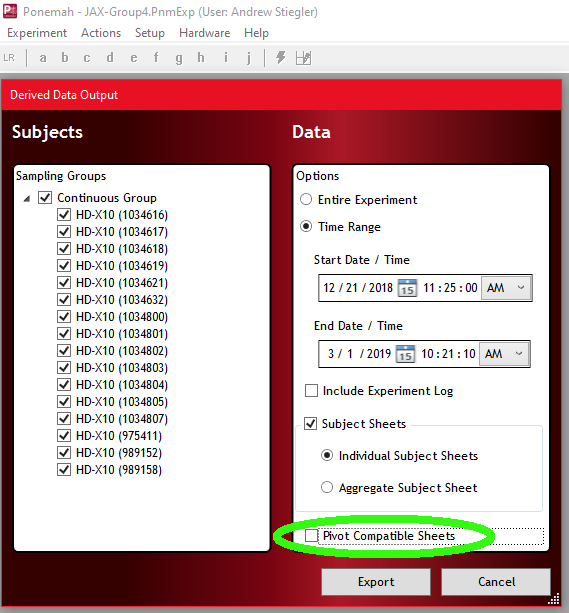

```{r setup, include = FALSE}
knitr::opts_chunk$set(
  collapse = TRUE,
  comment = "#>"
)
library(telemetRy)
library(magrittr)
library(ggplot2)
```

This vignette will show an example of importing data collected with a DSI 
telemetry system running Ponemah software into R. The first step is to export 
data from the DSI telemetry system.


## Importing DSI data
First data must be exported from DSI's Ponemah software. 

To export data: with an experiment open, navigate to Experiment > Export Data. 
In this pop-up, select subjects to export, a timerange to export, and make sure 
to un-check "Pivot Compatible Sheets"




Select "Export" and an Excel file will be generated. To import that Excel file 
into R, utilize the DSI_export_to_dataframe function:
```{r eval=FALSE}
exported_data <- DSI_export_to_dataframe('path_to_DSI_export')
```
A progress message will be displayed showing the current import status.

The output of the file is a dataframe:
```{r}
# Sample dataframe is included as sample_BP_data:
head(sample_BP_data) %>% print(digits = 3)
```
Where the .id column indicates the subject serial number, and the Time column 
is the real time of data acquisition. Several useful time columns are generated, 
including a column for time-of-day only, and elapsed time since acquisition 
started in several units. The rest of the telemetry parameters are named.

## After importing data
Several functions are available for data processing after import. The functions 
typical_day and circadian_avg both take the newly created dataframe as input.

To calculate a typical day:
```{r eval=TRUE}
# In our sample dataset, room lights turn on at 6AM
sample_typical_day <- typical_day(data = sample_BP_data, lights_on = 6)
head(sample_typical_day) %>% print(digits = 3)
```

To calculate circadian averages:
```{r eval=TRUE}
# In our sample dataset, room lights turn on at 6AM
sample_circadian_avg <- circadian_avg(data = sample_BP_data, lights_on = 6)
head(sample_circadian_avg[[1]])
```

Output from typical_day or circadian_avg can be plotted using ggplot:
```{r eval=TRUE}
# To plot typical SBP. first isolate SBP
sample_typical_sbp <- isolate_typical(data = sample_typical_day, 
                                      parameter = "SBP")
# Create a column for mean SBP
sample_typical_sbp$mean <- sample_typical_sbp %>% dplyr::select(-Time) %>% 
  rowMeans()

# Plot the mean against time in hours
ggplot(data = sample_typical_sbp)+
  geom_point(aes(x=Time/3600, y=mean))+
  ylab("Mean SBP (mmHg)")+
  xlab("Time (h)")+
  theme_classic()

# The second list element contains values when room is dark
sample_circadian_dark <- sample_circadian_avg[[2]]
# Isolate SBP
sample_circadian_dark_sbp <- isolate_typical(data = sample_circadian_dark, 
                                             parameter = "SBP")
# Create a column for mean SBP
sample_circadian_dark_sbp$mean <- sample_circadian_dark %>% 
  dplyr::select(-Time) %>% rowMeans()

# Plot the mean against time in days
ggplot(data = sample_circadian_dark_sbp)+
  geom_line(aes(x=Time, y=mean))+
  ylab("Mean SBP 12H-Dark (mmHg)")+
  xlab("Time (d)")+
  theme_classic()

```
